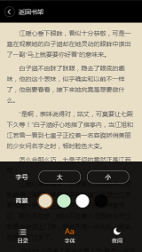
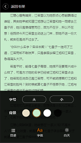

## WebApp—H5小说阅读器功能

运用HTML5、CSS3、JS流行技术，采用组件式开发模式。

### 使用技术：

**语言**：HTML5/CSS3/JavaScript

**插件**：

zepto.js: 使用于移动端的 js 库，语法与 jquery 相似，但增加了触摸等移动端事件，去掉了对浏览器兼容的代码，因此更轻量级。

jquery.base64.js: 解码 base64 编码的插件。

jquery.jsonp.js: 提供 jsonp 请求的插件。

### 实现功能：

1.点击内容区域唤醒字体设置面板，滑动页面 面板隐藏。

2.点击上一章/下一章更换内容并跳转至页面顶部。

3.字体大小切换(最大20px，最小12px)。

4.多种背景颜色切换。

5.白天/夜间模式切换。

6.可存储用户上次设置参数。

### 后台交互

项目是在 data 文件夹放了一些 json 文件，模拟服务端的返回值，这里要解决的问题有：

1）项目中请求的数据是多看阅读中的数据，那么，如何跨域请求?

使用 jsonp 来实现跨域，获取模拟服务端返回的数据。　

2）获取到了数据后，如何更新到页面。

### 效果截图：

